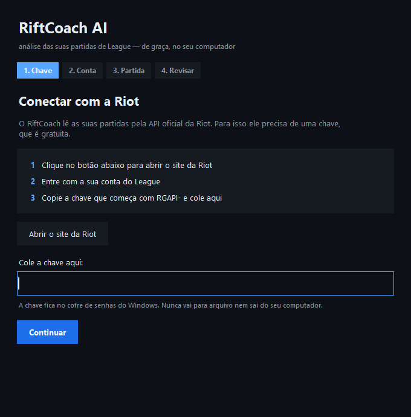
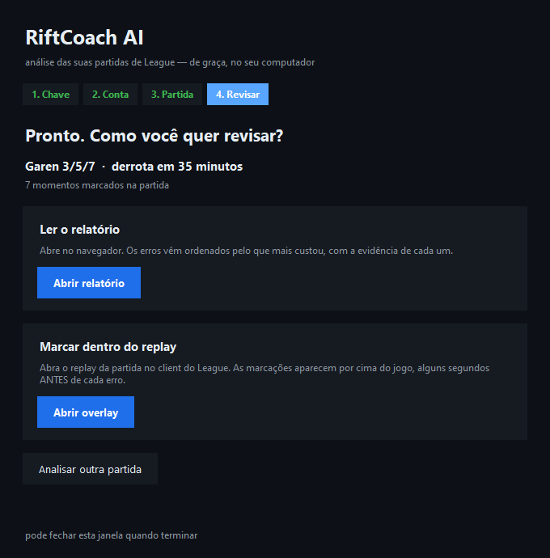
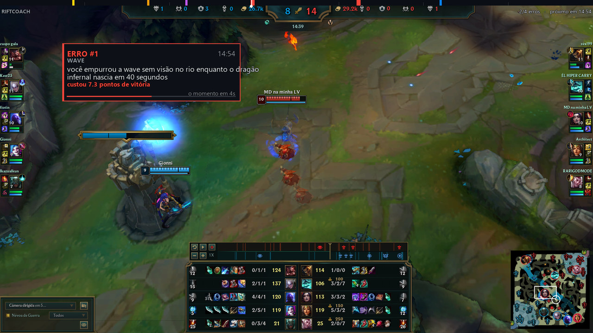
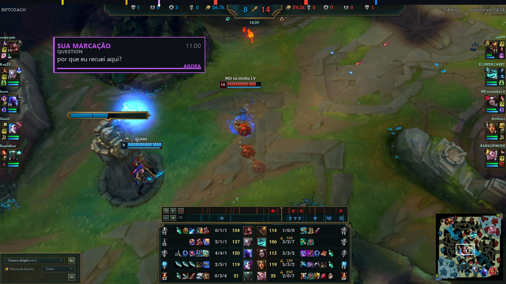

# RiftCoach AI — Manual de Uso

> Guia completo: instalação, configuração, uso e a tela de revisão.
> Para a arquitetura técnica, veja [ARCHITECTURE.md](ARCHITECTURE.md).
>
> **Este manual descreve o que existe hoje.** O que está planejado e ainda não funciona aparece
> marcado como tal (seção 6.4) — manual que promete função inexistente faz perder mais tempo
> que manual nenhum.

---

## 1. O que você precisa instalar

**Resposta curta: quase nada.**

| Item | Precisa? | Por quê |
|---|---|---|
| **League of Legends** | Sim, para o modo replay | O client é o único programa que reproduz `.rofl` |
| **uv** | Sim | Instala o Python e as dependências sozinho |
| Python | **Não** | O `uv` instala a versão certa para você |
| Ollama | Opcional | Só se quiser IA 100% local (precisa de GPU) |
| Player de replay | **Não** | Explicado abaixo |

### Sobre "programas que rodam replay de LoL"

Você perguntou se devemos usar um desses ou rodar o replay nós mesmos. A resposta é **nenhum dos
dois**:

**Não existe player de replay de LoL de terceiros.** O arquivo `.rofl` tem o conteúdo da partida
criptografado, e a chave não é recuperável depois. Os programas que aparecem em busca (ROFL Player e
similares) fazem uma coisa só: **abrem o client oficial** para você. Quem renderiza a partida é
sempre a Riot.

O RiftCoach faz o mesmo, só que melhor: controla o client oficial pela **Replay API** (uma API local
documentada pela Riot, na porta 2999). Quando você clica num erro marcado, o client pula sozinho para
aquele momento.

Consequência prática: **você não instala nada além do League de Legends que já tem.** E isso é o que
mantém tudo dentro das regras da Riot — a gente não decifra, não intercepta, não injeta nada.

> **Limite de prazo dos replays:** a Riot mantém replays baixáveis por cerca de 2 patches. Depois
> disso o arquivo não abre mais. O modo Telemetria (análise sem replay) continua funcionando para
> sempre, porque usa a API de partidas.

---

## 2. Instalação

### O jeito fácil: um arquivo, dois cliques

1. Baixe o projeto: [**Code → Download ZIP**](https://github.com/Kazualkun/LeagueCoaching/archive/refs/heads/main.zip)
2. Extraia a pasta em qualquer lugar
3. Dê **dois cliques em `RiftCoach.bat`**

**Na primeira vez** aparece uma janela preta baixando o que falta — Python e bibliotecas, cerca de
um minuto. Ela mostra o progresso de propósito: um programa que não dá sinal de vida durante um
minuto parece travado.

**Depois disso, você nunca mais vê terminal.** O que abre é esta janela:



São 4 passos, e a barra no topo mostra em qual você está:

| Passo | O que ele pede |
|---|---|
| 1. Chave | a chave gratuita da Riot — com botão que abre o site |
| 2. Conta | o seu Riot ID e a sua região |
| 3. Partida | nada; ele baixa e analisa sozinho |
| 4. Revisar | como você quer ver o resultado |

A janela **pergunta uma coisa de cada vez** e sempre diz qual é o próximo passo. Se algo der errado,
ela explica o que fazer — nunca deixa sem saída, e nenhuma das opções de recuperação apaga nada.

> **Pode fechar no meio.** Nada se perde: ao abrir de novo, ela continua de onde você parou e não
> repete pergunta já respondida.

No fim, você escolhe entre ler o relatório no navegador ou ver as marcações dentro do replay:



Nas próximas vezes, dois cliques no mesmo arquivo abrem direto nesta janela.

---

### O jeito manual (para quem usa terminal)

### Passo 1 — instalar o uv

**Windows (PowerShell):**
```powershell
powershell -c "irm https://astral.sh/uv/install.ps1 | iex"
```

**Mac / Linux:**
```bash
curl -LsSf https://astral.sh/uv/install.sh | sh
```

### Passo 2 — baixar e rodar

```bash
git clone https://github.com/Kazualkun/LeagueCoaching.git
cd LeagueCoaching
uv run riftcoach doctor
```

O `uv` baixa o Python 3.13 e todas as dependências na primeira execução (leva ~30s). Não precisa
criar venv, não precisa `pip install`.

### Passo 3 — chave da API da Riot

1. Acesse [developer.riotgames.com](https://developer.riotgames.com) e faça login com sua conta Riot
2. Na página inicial, copie a **Development API Key** (começa com `RGAPI-`)
3. No terminal:

```bash
uv run riftcoach auth
```

Cole a chave quando pedir. Ela vai para o **cofre de credenciais do sistema** (Gerenciador de
Credenciais no Windows, Keychain no Mac), nunca para um arquivo.

> ⚠️ **A chave de desenvolvimento expira a cada 24 horas.** Se aparecer erro de chave, gere outra no
> portal e rode `riftcoach auth` de novo.
>
> **Solução permanente:** no portal, vá em *Register Product* → *Personal API Key*, descreva o
> projeto ("ferramenta pessoal de análise pós-jogo"). A Personal Key tem o mesmo limite de taxa e
> **não expira**. A aprovação leva alguns dias.

### Passo 4 — sincronizar os dados do patch

```bash
uv run riftcoach sync-patch
```

Baixa nomes e atributos de itens, runas e campeões do DataDragon (a CDN pública da Riot). Sem isso, o
relatório mostra `3076` em vez de `Colete Espinhoso`.

### Passo 5 — ligar a Replay API do League

**Obrigatório para o modo replay.** A Replay API do jogo vem **desligada de fábrica** — a
documentação da Riot é explícita: *"By default the Replay API is disabled."*

```bash
uv run riftcoach enable-replay-api
```

O comando adiciona `EnableReplayApi=1` na seção `[General]` do `game.cfg` e grava um backup
`.riftcoach-bak` antes de mexer. Depois disso, **reabra o replay** para a mudança valer.

Se preferir editar à mão, o arquivo fica em
`C:\Riot Games\League of Legends\Config\game.cfg`:

```ini
[General]
EnableReplayApi=1
```

> **Sem esse passo**, `https://127.0.0.1:2999/replay/playback` responde 404 e o RiftCoach recusa a
> conexão. Ele vai dizer exatamente isso — não precisa adivinhar.

### Passo 6 — conferir

```bash
uv run riftcoach doctor --riot-id "SeuNome#TAG"
```

As quatro APIs devem aparecer em verde:

```
┌───────────────┬──────────┬────────┬────────────────┐
│ API           │ Host     │ Status │ Detalhe        │
├───────────────┼──────────┼────────┼────────────────┤
│ LOL-STATUS-V4 │ br1      │ ok     │ ok             │
│ ACCOUNT-V1    │ americas │ ok     │ SeuNome#BR1    │
│ MATCH-V5      │ americas │ ok     │ 1 registro(s)  │
│ LEAGUE-V4     │ br1      │ ok     │ 2 registro(s)  │
└───────────────┴──────────┴────────┴────────────────┘
```

> **Seu Riot ID** é o `Nome#TAG` que aparece no client — não o nome de invocador antigo. A tag nem
> sempre é `BR1`; pode ser qualquer coisa que você escolheu.

---

## 3. Configuração

Tudo tem padrão sensato. Só mexa se precisar.

### Pelo arquivo `.env` (copie de `.env.example`)

```ini
RIOT_PLATFORM=br1          # br1, na1, euw1, kr, las, lan...
LOCALE=pt_BR               # idioma dos nomes de item e do relatório
PRIVACY_MODE=relaxed       # strict = nada sai da sua máquina
```

### As opções que importam

| Opção | Valores | O que faz |
|---|---|---|
| `RIOT_PLATFORM` | `br1`, `na1`, `euw1`, `kr`... | Sua região. Define de onde as partidas vêm |
| `LOCALE` | `pt_BR`, `en_US`, `es_MX`... | Idioma dos nomes **e** do relatório. Os dois andam juntos |
| `PRIVACY_MODE` | `relaxed` / `strict` | `strict` **bloqueia qualquer provedor de nuvem**, antes de qualquer outra escolha |

> **Sobre `LOCALE`:** não é só cosmético. O validador confere os nomes de item que a IA escreve
> contra a tabela do patch. Banco em inglês + relatório em português faria todo item ser rejeitado
> como inventado. Por isso os dois são a mesma configuração.

### Escolhendo onde a IA roda

O assistente detecta seu hardware e recomenda. Resumo:

| Sua GPU | Recomendação | Comando |
|---|---|---|
| 24 GB+ (4090, 3090, 7900 XTX) | 100% local | `ollama pull qwen3:30b-a3b` |
| 12–16 GB (4070, 3080) | 100% local | `ollama pull qwen3:14b` |
| 8 GB | Local ou nuvem | `ollama pull qwen3:8b` |
| Apple Silicon 16 GB+ | 100% local | `ollama pull qwen3:14b` |
| Sem GPU / notebook | Nuvem grátis | Chave do Google AI Studio |

**Se tudo falhar, o relatório ainda sai.** Sem GPU, sem chave de IA, sem nada: você ainda recebe
percentis de referência, curva de vantagem, erros medidos, mapa de mortes e eficiência de recall —
tudo calculado localmente, sem modelo nenhum.

---

## 4. Usando

### Análise rápida (sem replay)

```bash
uv run riftcoach fetch "SeuNome#TAG" -n 5 -q 420
```

| Flag | Significado |
|---|---|
| `-n 5` | quantas partidas baixar |
| `-q 420` | fila: `420` ranked solo, `440` flex, `400` normal draft, `450` ARAM |

> **Só Summoner's Rift.** Arena (`CHERRY`) é rejeitada de propósito: naquele modo as métricas da Riot
> vêm zeradas, e analisar produziria números falsos com cara de medição.

### O relatório

```bash
uv run riftcoach analyze "SeuNome#TAG"
```

Analisa a sua partida mais recente e imprime o relatório. **Não precisa de GPU, nem de chave de IA,
nem de internet além da própria API da Riot** — tudo é calculado em Python nesta máquina.

| Flag | Significado |
|---|---|
| `-m BR1_123456` | analisar uma partida específica em vez da mais recente |
| `-l 3` | analisar a 3ª partida mais recente |
| `-q 420` | considerar só uma fila ao procurar a partida |
| `-o relatorio.txt` | gravar num arquivo em vez de imprimir |
| `--no-history` | não usar o seu próprio histórico como referência de percentil |

### Ligando a IA

```bash
uv run riftcoach models
```

Mostra o hardware detectado, quais provedores estão disponíveis e **por que os outros não estão**.
Este comando existe porque "a IA não rodou" precisa ter uma resposta: sem ele, um serviço fora do ar
e uma chave ausente são indistinguíveis do lado de fora.

Você tem três caminhos, e nenhum deles é obrigatório:

| Caminho | Como | Custo |
|---|---|---|
| **Local** | Instale o [Ollama](https://ollama.com) e rode `ollama pull qwen3:8b` (ou o modelo que o `models` recomendar para a sua placa) | nada sai da sua máquina |
| **Nuvem grátis** | Chave do [Google AI Studio](https://aistudio.google.com) em `GEMINI_API_KEY`, ou [Groq](https://console.groq.com) em `GROQ_API_KEY` | gratuito, com cota diária |
| **Nenhum** | Não faça nada | o relatório determinístico completo |

As chaves vão no cofre do sistema ou numa variável de ambiente — nunca em arquivo versionado.

```bash
riftcoach analyze "Nome#TAG"            # usa IA se houver; degrada sozinho se não
riftcoach analyze "Nome#TAG" --no-ai    # força o relatório determinístico
```

**Privacidade.** Com `PRIVACY_MODE=strict`, todo provedor de nuvem é eliminado **antes** de qualquer
outra consideração de roteamento — não é preferência, é filtro. Se sobrar só nuvem, o resultado é o
relatório sem IA, nunca um envio silencioso.

**Ordem de escolha.** Local vence nuvem gratuita, que vence paga. Não é só economia: modelo local não
tem cota, então um relatório em lote nunca queima a franquia diária de que uma pergunta interativa vai
precisar. A exceção é quando o local é lento demais (abaixo de ~15 tokens/s) e a tarefa é interativa —
aí a nuvem ganha.

**Sobre os percentis.** O relatório compara os seus números com uma população, e sempre diz **qual**
entre colchetes. São três fontes, da melhor para a pior:

| Fonte | Quando aparece |
|---|---|
| `amostra da Riot` | existe um parquet de benchmarks para o patch da partida |
| `seu próprio histórico, N partidas` | você tem pelo menos 10 partidas da mesma rota em cache |
| `modelo embarcado (não calibrado)` | nenhuma das outras — é um chute educado, e ele diz isso |

A terceira é o padrão no primeiro dia. Para sair dela rápido, rode `fetch -n 20` uma vez: o `analyze`
passa a usar o seu próprio histórico, que para rotas e campeões fora do meta é a comparação mais
honesta que existe.

> **Partidas muito curtas não geram percentil nenhum.** Num remake de 1:10 ninguém jogou o suficiente
> para ter um número que descreva o jogo, e "0 CS aos 10 minutos" seria uma medição que nunca
> aconteceu, não um percentil baixo.

### A interface web

```bash
uv run riftcoach web "SeuNome#TAG"
```

Abre o relatório no navegador: a curva de probabilidade de vitória com um marcador em cada erro, os
findings com o nível de evidência de cada afirmação, e os benchmarks com a fonte de cada percentil.

O servidor escuta **só em 127.0.0.1**. Não há login porque não há superfície remota.

| Flag | Significado |
|---|---|
| `-m BR1_123456` | uma partida específica |
| `-l 3` | a 3ª partida mais recente |
| `--no-ai` | força o relatório determinístico |
| `-p 8080` | outra porta |
| `--no-open` | não abrir o navegador sozinho (útil em servidor) |

### Revisão com replay sincronizado

1. Abra o League of Legends
2. No histórico de partidas, baixe o replay e dê play
3. Com o replay rodando, rode `riftcoach web "SeuNome#TAG"`

O RiftCoach detecta o replay e **sincroniza o relógio sozinho** — são três relógios diferentes
(timeline da Riot, arquivo de replay, vídeo) e eles não concordam. Clicar num erro faz o client pular
para lá.

> **Ele sempre pula 8 segundos ANTES do momento marcado.** Não é bug. O erro é a decisão, não a
> consequência — pular exatamente na sua morte mostra você morrendo, não o que causou.

**Se não houver replay rodando, o botão fica desabilitado e a página diz por quê.** O relatório
inteiro funciona sem ele; o replay é o acréscimo, não o produto.

#### Por que ele às vezes recusa

O RiftCoach verifica `GET https://127.0.0.1:2999/replay/playback` **antes de cada requisição** ao
client. Essa rota só existe enquanto um replay está rodando. Qualquer resultado ambíguo — 404,
timeout, conexão recusada, corpo inesperado — vira recusa.

Isso é deliberado e não é configurável. Durante uma partida ao vivo essa rota some enquanto o resto
da API local continua respondendo, então um 404 ali é indício de que pode haver partida em andamento.
Raciocínio completo em [COMPLIANCE.md](../COMPLIANCE.md).

---

## 5. Lendo o relatório

### A curva de vantagem

Funciona como a avaliação de uma engine de xadrez, mas em probabilidade de vitória:

```
min   ouro-eq    wp
  0        +0   50%  --------------------|--------------------
  9      -362   48%  -------------------|---------------------
 18     -3759   34%  --------------|--------------------------
 26    -11458   16%  ------|----------------------------------
 36    -26011    4%  --|--------------------------------------
```

Onde a linha despenca, algo caro aconteceu. E o relatório diz o quê.

### Erros medidos

```
18:15 [sev4] -11.1pp  direct      morreu na jungle superior própria, com RIFTHERALD_EM_32s
18:47 [sev4] -12.2pp  positional  perdeu RIFTHERALD; você estava em OWN_BASE
```

- **`-11.1pp`** = quanto de probabilidade de vitória aquilo custou. É medido, não opinião
- **`sev4`** = crítico (aparece em vermelho na linha do tempo)
- **`direct` / `positional` / `team`** = seu grau de envolvimento:

| | Significa | O que treinar |
|---|---|---|
| `direct` | você morreu / entregou o objetivo | decisão individual |
| `positional` | aconteceu longe, e você estava no lado errado do mapa | leitura de mapa, rotação |
| `team` | você estava lá e mesmo assim deu errado | execução de luta |

### Níveis de confiança — leia isto

Toda afirmação vem marcada com o quanto ela é confiável:

| Nível | Significa | Exemplo |
|---|---|---|
| **T1** | **Medido** direto dos dados da Riot | "CS@10 = 67" |
| **T2** | **Derivado**, com a premissa declarada | "estava empurrando (ritmo de CS + posição)" |
| **T3** | **Inferido** de vídeo | "a wave estava em slow push" |

**Por que isso existe:** a API da Riot **não tem** campo de estado de wave. Um coach que afirma com
certeza "você devia ter dado freeze" está chutando. O nosso diz *"seu ritmo de CS e sua posição
indicam que você estava empurrando (derivado) — se isso estiver certo, o freeze estava disponível"*.

Você consegue conferir. É exatamente esse o ponto.

### O que ainda não é analisável

Duas coisas dependem do modo replay/vídeo, porque **a telemetria não tem o dado**:

| Análise | Por quê |
|---|---|
| **Troca de dano** | A vida só é registrada **de minuto em minuto**; uma troca dura segundos |
| **Combo** | A timeline **não emite nenhum evento de uso de habilidade** |

Não é omissão nossa — o dado não existe na API. As duas vão sair pela leitura de tela no modo replay,
e mesmo lá ficam marcadas como **T3**.

---

## 6. A tela de revisão

> **O que está nesta seção existe e funciona hoje.** O que ainda não existe está na seção 6.4,
> separado de propósito — manual que descreve função inexistente faz perder mais tempo que manual
> nenhum.

### 6.1 O que abrir

```bash
uv run riftcoach web "SeuNome#TAG"
```

Ele analisa a partida, sobe um servidor local e **abre seu navegador sozinho** em
`http://127.0.0.1:8770`. Nada é publicado na internet — o servidor só escuta em `127.0.0.1`, ou seja,
só a sua máquina alcança.

| Flag | Para quê |
|---|---|
| `-m BR1_123456` | uma partida específica |
| `-l 3` | a 3ª partida mais recente |
| `--no-open` | não abrir o navegador (útil em servidor) |
| `-p 8771` | outra porta |

### 6.2 O que aparece na tela

```
┌──────────────────────────────────────────────────────────────────────────┐
│  RiftCoach · Pyke SUP · BR1_3285629030 · patch 16.18 · VITÓRIA           │
│  relatório determinístico (nenhum modelo de IA foi usado)                │
├──────────────────────────────────────────────────────────────────────────┤
│  CURVA DE VANTAGEM — probabilidade de vitória por minuto                  │
│      56% ▆▆▅▅▄▄▅▆▆▇▇█                                                    │
│      0                    12                     24 min                   │
├──────────────────────────────────────────────────────────────────────────┤
│  #1  gravidade 4  ·  15:40  ·  macro                                     │
│      Você morreu em 15:40 com RIFTHERALD_EM_34s — e isso aconteceu 3x    │
│      [T1, medido]    morte D4 em ENEMY_JUNGLE_TOPSIDE                    │
│      [T2, derivado]  estado de wave: NOT_IN_LANE                         │
│                      premissa: a API não tem campo de wave               │
│      Correção: ...      Treino: ...            [ ▶ Pular para 15:32 ]    │
├──────────────────────────────────────────────────────────────────────────┤
│  #2  gravidade 3  ·  13:17  ·  objetivos          [ ▶ Pular para 13:09 ] │
│  #3  gravidade 3  ·  13:59  ·  decisão            [ ▶ Pular para 13:51 ] │
├──────────────────────────────────────────────────────────────────────────┤
│  BENCHMARKS — UTILITY DIAMOND                                            │
│    visão por minuto  2.9   p91   [modelo embarcado (não calibrado)]      │
└──────────────────────────────────────────────────────────────────────────┘
```

**O botão `▶ Pular`** é o coração do modo replay. Com um replay aberto no client, clicar nele faz o
League navegar até o momento — **8 segundos antes**, porque o erro é a decisão, não a consequência.

Sem replay aberto, o botão responde explicando o que falta. Não trava nem dá erro genérico.

### 6.3 Marcações dentro do replay (o overlay)

Esta é a forma de revisar mais próxima de ter um coach do lado. O RiftCoach desenha por cima da
janela do jogo, sincronizado com o relógio do próprio replay.

**Antes de abrir, dois pré-requisitos que ninguém adivinha:**

1. A **Replay API precisa estar ligada** (seção 2, passo 5) — vem desligada de fábrica.
2. O jogo precisa estar em **"Sem bordas"**. Em tela cheia exclusiva o Windows não permite que nada
   apareça por cima; não é limitação do RiftCoach. Troque em Configurações → Vídeo → Modo de janela.

**Como abrir**, pela janela: clique em **Abrir overlay** na tela final. Pelo terminal:

```bash
uv run riftcoach overlay "SeuNome#TAG"
```

Depois abra o replay no client, dê play — e **clique na janela do jogo**.

> **Esse último passo não é detalhe.** O overlay só desenha por cima do League, e só enquanto o
> League é a janela ativa. Enquanto você estiver olhando para o terminal ou para a janela do
> RiftCoach, ele fica escondido **de propósito** — senão ficaria flutuando por cima do navegador
> enquanto você lê o relatório. Quando você clica no jogo, ele aparece.

Assim que aparecer, um cartão verde confirma que conectou, diz quantos erros existem na partida, o
que cada cor significa e em que minuto está o primeiro. Ele some sozinho depois de alguns segundos.

#### O que aparece



**O cartão entra ANTES do erro**, com uma barrinha contando quanto falta. Essa é a decisão de design
mais importante do overlay inteiro: se ele aparecesse só no instante marcado, você leria o
diagnóstico depois de já ter visto o desfecho — a resposta antes da pergunta. Aparecendo antes, você
lê, olha, e vê acontecer. Quando chega o momento, a barra enche e o texto vira **AGORA**.

Cada cartão traz:

| Parte | O que é |
|---|---|
| `ERRO #3` | a posição na lista, ordenada pelo que mais custou |
| a categoria | wave, posicionamento, objetivo, recall... |
| o minuto | o instante exato da decisão |
| a frase | **o que observar**, não a correção — a correção está no relatório |
| `custou 7.3 pontos` | a perda medida em probabilidade de vitória, quando há blunder medido perto |

**A faixa no topo** é a partida inteira. Cada marcação é um traço, colorido pela gravidade: erro
crítico é vermelho e o dobro de largo, erro médio é laranja, leve é amarelo, e as suas marcações têm
cor própria. A linha branca é onde o replay está.

**No minimapa**, um anel acompanha onde você estava, com um rastro pontilhado do último minuto. O
anel é largo de propósito: a Riot só entrega uma posição por minuto, e um ponto fino fingiria uma
precisão que não existe.

#### Os atalhos

Com a **janela do jogo na frente**:

| Atalho | O que faz |
|---|---|
| `Ctrl+Alt+E` | marcar um erro seu |
| `Ctrl+Alt+N` | uma anotação |
| `Ctrl+Alt+G` | algo que você fez bem |
| `Ctrl+Alt+Q` | uma dúvida para rever depois |
| `Ctrl+Alt+S` | pular para a **próxima** marcação (8 s antes dela) |
| `Ctrl+Alt+R` | voltar para **onde você parou** da última vez |
| `Ctrl+Alt+H` | esconder o overlay |

`Ctrl+Alt+S` transforma a revisão num passeio guiado: você percorre os seus erros em ordem, sem
tocar na linha do tempo do client.



#### As marcações ficam salvas

Ao reabrir a mesma partida, as suas anotações voltam junto com as da IA, e o overlay avisa em que
minuto você parou. Reanalisar a partida com um modelo melhor troca as marcações da IA e **não
encosta nas suas** — elas são o único dado aqui que não dá para recalcular.

E é comparando as duas que se aprende mais:

- onde a **IA marcou crítico e você não sentiu nada** → ponto cego;
- onde **você sentiu que errou e a medição não viu** → quase sempre troca de dano, combo ou
  posicionamento fino, que a telemetria da Riot simplesmente não registra.

Para levar as marcações para fora (um Discord de time, por exemplo):

```bash
uv run riftcoach marcacoes BR1_3285629030 --riot-id "SeuNome#TAG"
uv run riftcoach marcacoes BR1_3285629030 --riot-id "SeuNome#TAG" --formato json
```

### 6.4 O que ainda NÃO existe

| Planejado | Estado |
|---|---|
| Escrever um texto livre na sua marcação | ☐ hoje ela grava só o tipo e o minuto |
| Clicar numa marcação da faixa para pular | ☐ o overlay atravessa o clique de propósito, para nunca atrapalhar o jogo |
| Perguntar à IA sobre um momento específico | ☐ depende da camada de IA |
| Desenhar setas e círculos no espaço 3D do jogo | ☐ exige projetar câmera; hoje só minimapa, que é 2D e exato |

---

## 7. Perguntas frequentes

**Dá ban?** Não. O RiftCoach nunca roda durante partida ao vivo — é arquiteturalmente incapaz disso.
Antes de **cada** chamada ao client ele confere se um replay está rodando; se não estiver, recusa.
Detalhes em [COMPLIANCE.md](../COMPLIANCE.md).

**Meus dados saem da máquina?** Só se você escolher um provedor de nuvem. Com `PRIVACY_MODE=strict`,
provedores de nuvem são filtrados no roteador, antes de qualquer outra decisão.

**Preciso de GPU?** Não. Tiers gratuitos de nuvem funcionam bem, e o relatório estatístico funciona
sem nada.

**Por que a análise pede o replay?** Não pede. O modo Telemetria dá ~80% do valor só com o match ID.
O replay adiciona a revisão clicável e a análise de tela.

**Funciona com ARAM ou Arena?** Só Summoner's Rift. O parser não quebra em outros modos — ele recusa
explicitamente, porque analisar produziria métricas zeradas com aparência de medição.

**Por que os recalls são "inferidos"?** Porque a Riot não emite evento de recall. Deduzimos de
agrupamentos de compra (só dá para comprar na base) mais transições de posição. Por isso é T2.

**Analisou uma partida antiga e os nomes dos itens estão estranhos.** Rode
`uv run riftcoach sync-match-patches` — ele baixa os dados de **todos** os patches das suas partidas
em cache. O relatório sempre usa o patch em que a partida foi jogada, nunca o atual.

---

## 8. Se der errado

| Sintoma | Causa | Solução |
|---|---|---|
| `Unknown apikey` (401) | A chave foi substituída no portal | Copie a chave atual e rode `riftcoach auth` |
| `403 Forbidden` | Chave expirada (24h) | Gere outra e rode `riftcoach auth` |
| `Não encontrado` (404) | Riot ID errado | Confira `Nome#TAG` no client e a região no `.env` |
| `mapId 30 não é Summoner's Rift` | Partida de Arena | Use `-q 420` para filtrar ranked solo |
| `League client não está rodando` | Sem replay aberto | Abra o replay antes |
| `a Replay API do League está desligada` | Falta `EnableReplayApi=1` | `uv run riftcoach enable-replay-api` |
| `certificado do client não confere` | Certificado ainda não fixado | `uv run riftcoach pin-cert` |
| `os relógios ainda não assentaram` | Seek recente; o jogo ainda simula | Espere ~5s e tente de novo |
| `Parece haver uma partida ao vivo` | Proteção de conformidade | Encerre a partida — o RiftCoach nunca roda ao vivo |
| Itens aparecem como números | Patch não sincronizado | `uv run riftcoach sync-match-patches` |

Diagnóstico completo:

```bash
uv run riftcoach doctor --riot-id "SeuNome#TAG"
```

Ele testa cada API separadamente e mostra a mensagem original da Riot — testar em bloco esconderia
qual delas é o problema.
